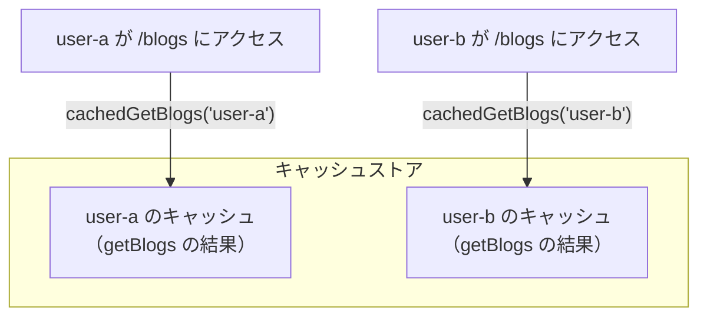
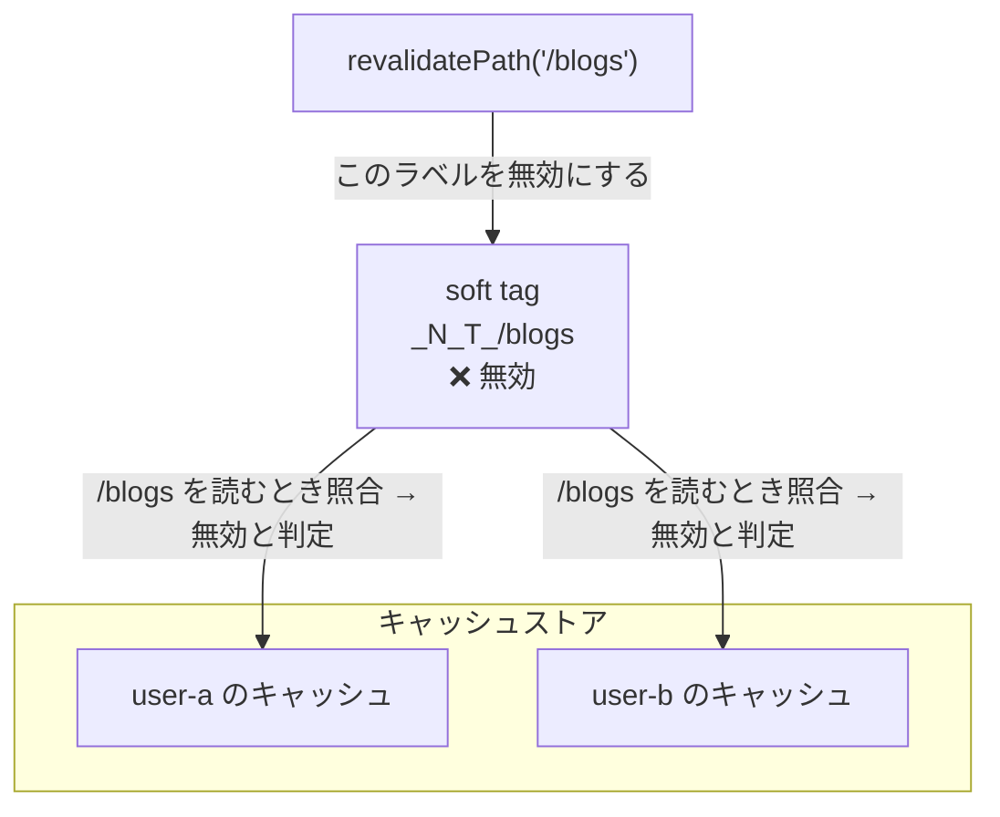
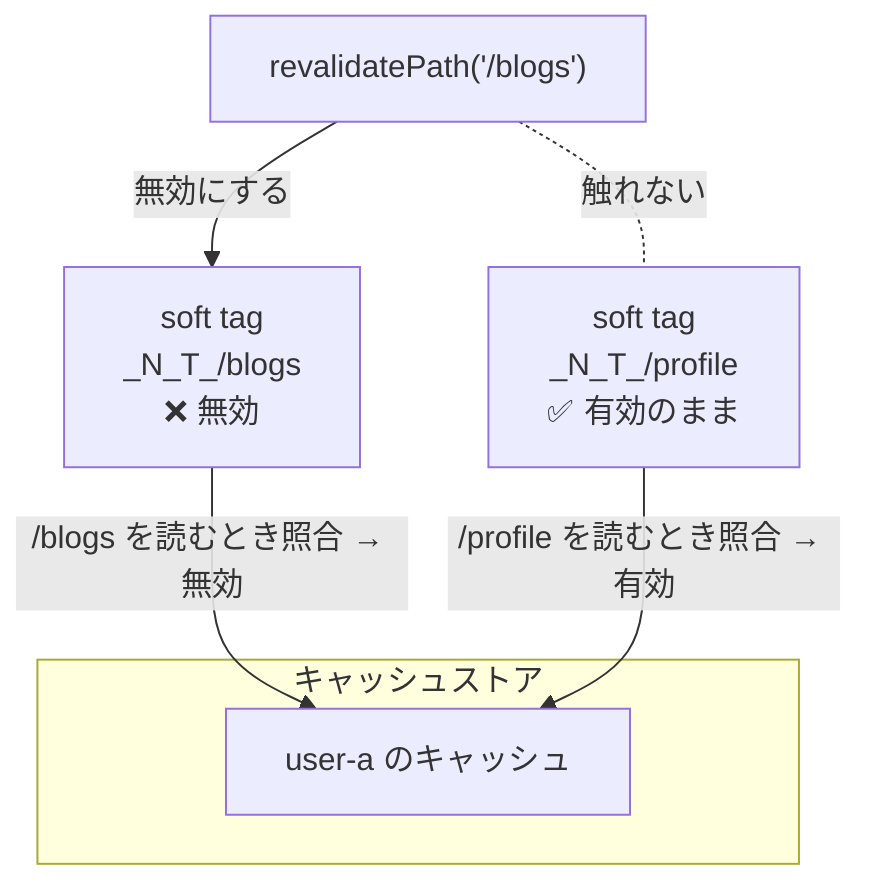
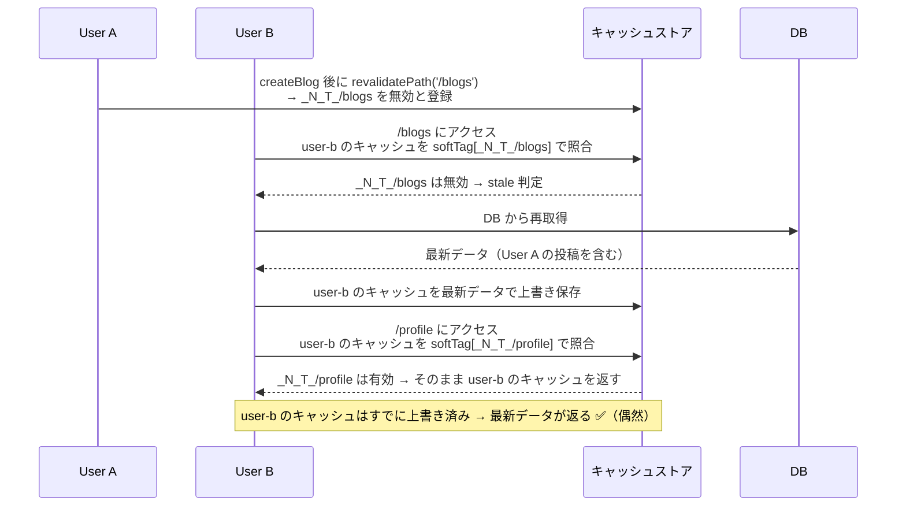

# revalidatePath の使い方

## revalidatePath とは

特定の URL パスに関連するキャッシュを即時無効化する関数です。
**ポイントはパージ後にアクセスしたタイミングでキャッシュエントリが上書きされるということ。アクセスされるまではキャッシュエントリは有効。**

```typescript
import { revalidatePath } from 'next/cache'

// Server Action または Route Handler 内で呼ぶ
revalidatePath('/blogs')
```

---

## 大前提：キャッシュはパス単位ではなく、関数＋引数の単位で保存される

`unstable_cache` のキャッシュは **「どのページから呼ばれたか」ではなく「何の関数を何の引数で呼んだか」** で識別されます。

つまり引数としてユーザ id を渡している場合、user-a と user-b でそれぞれのキャッシュエントリが作られます（計 2 つのキャッシュ）。

```
cachedGetBlogs("user-b") を /blogs から呼んだ場合
cachedGetBlogs("user-b") を /profile から呼んだ場合
  → どちらも同じ「user-b のキャッシュ」を読み書きする
```

パスが違っても、関数と引数が同じなら**同じキャッシュエントリを共有します**。

### 読み取り時に「再取得すべきか」を判定する仕組み

キャッシュエントリは「user-a のキャッシュ」「user-b のキャッシュ」の 2 つだけです。パスごとに別エントリは作られません。

`revalidatePath('/blogs')` が行うのは「次に `/blogs` から読まれたとき、再取得しろ」という**予約**だけです。

```
① revalidatePath('/blogs') を呼ぶ
     → 「_N_T_/blogs を無効」と台帳にメモするだけ。エントリは消えない

② User B が /blogs にアクセス
     → user-b のキャッシュを読む前に台帳を確認 → _N_T_/blogs が無効 → DB 再取得 → user-b のキャッシュを上書き

③ User B が /profile にアクセス
     → user-b のキャッシュを読む前に台帳を確認 → _N_T_/profile は有効 → user-b のキャッシュをそのまま返す
     → ただし user-b のキャッシュはすでに②で上書き済みなので、結果的に最新データが返る
```

`/profile` が更新されて見えるのは「`revalidatePath` が `/profile` を無効化した」からではなく、「`/blogs` を経由したことで user-b のキャッシュの中身が最新になっていたから」です。

---

## 図で理解する

### 図1：userId はキャッシュエントリを分ける

`cachedGetBlogs` に渡す引数が違えば、キャッシュエントリは別々に保存されます。



---

### 図2：revalidatePath はパスで全エントリをまとめて無効化する

soft tag はキャッシュの読み取り時に「このデータはまだ有効か？」を確認するための照合ラベルです。`/blogs` のレンダリング中に作られたエントリはすべて `_N_T_/blogs` で照合されるため、`revalidatePath('/blogs')` を呼ぶと **user-a・user-b まとめて無効化**されます。



つまり「`revalidatePath` は userId を気にしない」ということです。パスが同じなら全員まとめて無効化します。

---

### 図3：別パスは別の soft tag なので無効化されない

`/blogs` と `/profile` で同じ `cachedGetBlogs("user-a")` を使っていても、パスが違えば soft tag が別物になります。



**同じ「user-a のキャッシュ」でも、どのページから読むかによって有効・無効の判定が変わります。**
`revalidatePath('/blogs')` 後に `/profile` に redirect すると、「user-a のキャッシュ」は「`/profile` の soft tag で見れば有効」なので古いデータが返ります。

---

### 図4：/blogs を経由すると /profile も更新されて見える（落とし穴）

「User A がブログ投稿 → User B が `/blogs` → User B が `/profile`」の順で操作すると、`/profile` でも更新後のデータが見えます。しかしこれは `revalidatePath` が `/profile` を無効化したのではなく、**`/blogs` のレンダリングで user-b のキャッシュが上書きされた副作用**です。



**なぜ偶然なのか：**

`/profile` の soft tag `_N_T_/profile` は一切無効化されていません。たまたま `/blogs` のレンダリングで user-b のキャッシュが最新データに更新されていたから、`/profile` でも最新データが見えただけです。

User B が `/blogs` を経由せずに直接 `/profile` を訪れていたら、古いデータが返っていました。

```
User B の訪問順序によって結果が変わる（壊れた設計のサイン）

  /blogs → /profile の順 → 更新されて見える（偶然）
  /profile だけ訪問     → 古いデータのまま
```

**この挙動に依存してはいけません。** 複数ページで同じデータを最新に保ちたいなら `revalidateTag` を使ってください。

---

## soft tag とは

`revalidatePath` を理解するために、まず **soft tag** という概念を知る必要があります。

ページがレンダリングされるとき、そのページで取得されたキャッシュデータに **「このデータは /blogs のレンダリングで使われた」** というラベルが自動で付きます。これが soft tag です。

`revalidateTag` で使う explicit tag（開発者が `{ tags: ["getBlogs"] }` と手動で付けるタグ）と違い、soft tag は **Next.js が URL パスから自動で生成・管理します**。開発者が意識して付ける必要はありません。

```
/blogs をレンダリング
  → cachedGetBlogs("user-a") が呼ばれる
  → Next.js が自動で「_N_T_/blogs」というラベルを付けて管理する

/profile をレンダリング
  → cachedGetBlogs("user-a") が呼ばれる（同じ関数・同じ引数）
  → Next.js が自動で「_N_T_/profile」というラベルを付けて管理する
```

> `_N_T_` は Next.js が soft tag に付ける内部プレフィックスです。開発者が直接触ることはありません。

---

## revalidatePath の仕組み

`revalidatePath('/blogs')` を呼ぶと、内部では次のことが起きます。

```
revalidatePath('/blogs')
  → 「_N_T_/blogs」というラベルを「無効」と登録する
  → 次回 /blogs をレンダリングするとき、このラベルを持つデータが再取得される
```

`revalidateTag` と本質的に同じ仕組みで動いています。違いは「開発者が付けるタグ」か「パスから自動生成されるタグ」かだけです。

| | `revalidateTag` | `revalidatePath` |
|---|---|---|
| タグの種類 | 開発者が `{ tags: [...] }` で付ける | パスから自動生成（soft tag） |
| 事前準備 | `unstable_cache` への `tags` 指定が必要 | 不要 |
| 向いている用途 | 複数ページをまたぐデータの更新 | 1つのページのキャッシュを手軽に消したいとき |

> 公式ドキュメントより：より精密で過剰な無効化を避けられるため、`revalidateTag` を優先して使うことが推奨されています。

---

## 重要な罠：別パスのキャッシュは無効化されない

`/blogs` と `/profile` が同じ `getBlogs` 関数を使っていても、soft tag はパスごとに別物です。

```
/blogs のデータ  → soft tag: _N_T_/blogs
/profile のデータ → soft tag: _N_T_/profile  ← 別もの
```

`revalidatePath('/blogs')` は `_N_T_/blogs` しか無効化しないため、`/profile` のキャッシュはそのまま残ります。

```typescript
// NG：/profile のキャッシュは無効化されない
revalidatePath('/blogs')
redirect('/profile')  // /profile は古いデータを返し続ける
```

```typescript
// OK：タグを使えばパスをまたいで無効化できる
revalidateTag(BLOGS_CACHE_TAG, { expire: 0 })
redirect('/profile')  // /profile も最新データを返す
```

> **なぜ開発中は「更新された」ように見えるのか？**
> `redirect('/blogs')` をしている場合、`/blogs` のレンダリングで一度データが再取得されてキャッシュが上書きされます。その後 `/profile` を開くと、そのキャッシュを見るので更新されたように見えます。「`revalidatePath` が `/profile` を無効化した」のではなく「`/blogs` 経由でたまたまキャッシュが更新された」だけです。`redirect('/profile')` に変えると古いデータが返ります。

---

## 第二引数 type について

```typescript
revalidatePath(path: string, type?: 'page' | 'layout')
```

第二引数 `type` は「どの範囲を無効化するか」を指定します。

| type | 無効化される範囲 |
|---|---|
| 省略（固定パスのとき） | 指定したページのみ |
| `'page'` | 動的ルートにマッチする全ページ |
| `'layout'` | 指定レイアウト＋その配下にある全ページ |

### 固定パスは type 不要

```typescript
// /blogs というページ1つだけを無効化
revalidatePath('/blogs')
```

### 動的ルートは type: 'page' が必要

`/blogs/[slug]` のように動的セグメントがある場合、`type` を省略すると警告が出て何も無効化されません。

```typescript
// ❌ 動的ルートで type を省略すると無効化されない
revalidatePath('/blogs/[slug]')

// ✅ /blogs/1, /blogs/2, /blogs/abc ... すべてのページを無効化
revalidatePath('/blogs/[slug]', 'page')
```

### type: 'layout' で配下をまとめて無効化

```typescript
// /blogs/[slug]/layout.tsx 以下の全ページを無効化
// → /blogs/1, /blogs/1/comments, /blogs/1/edit ... まとめて対象になる
revalidatePath('/blogs/[slug]', 'layout')

// ルートレイアウト以下 = サイト全体を無効化
revalidatePath('/', 'layout')
```
